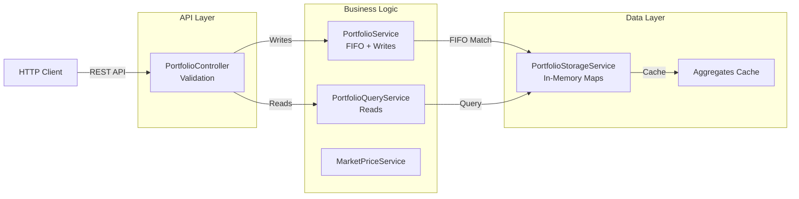
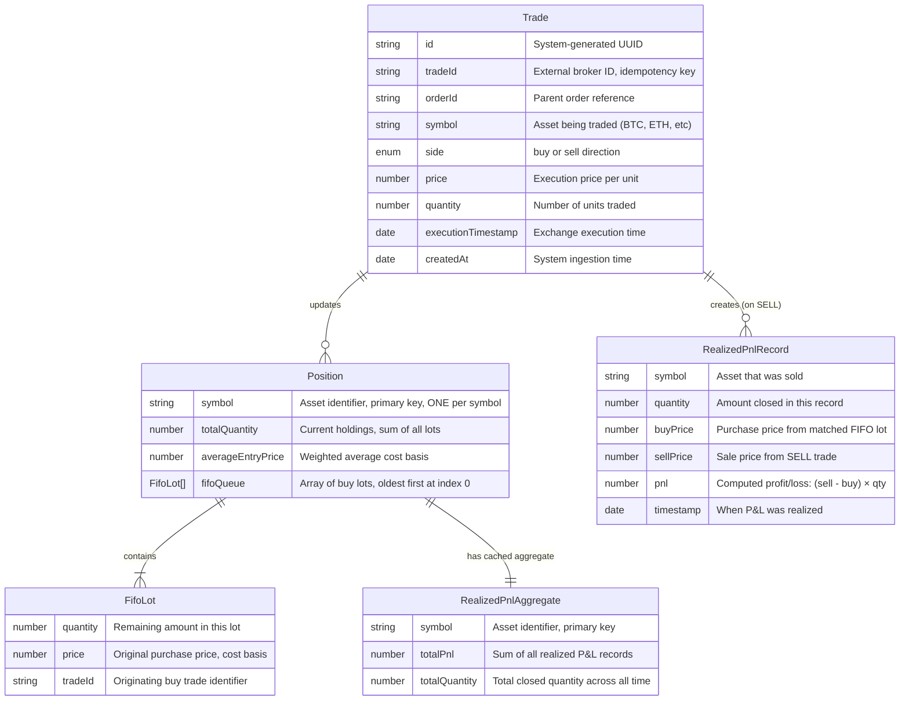
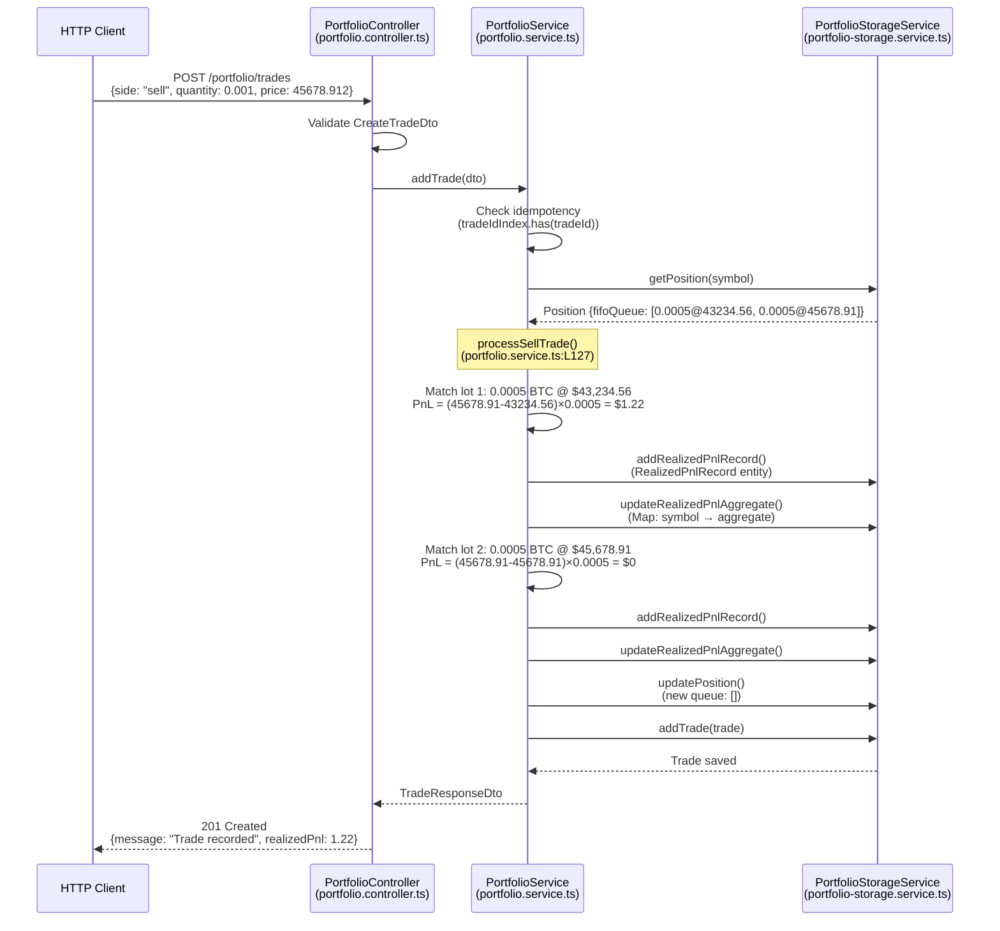
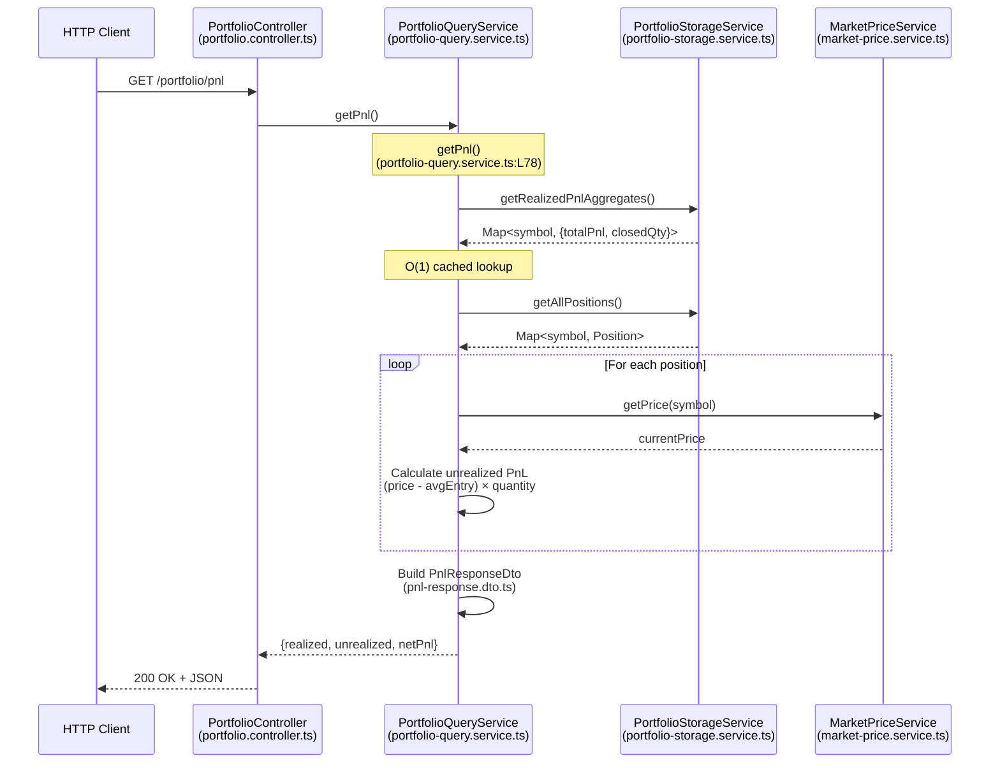
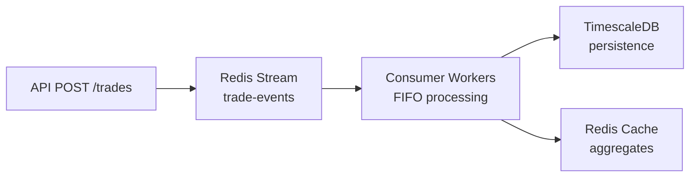

# Portfolio & PnL Tracker

Crypto portfolio tracker with FIFO accounting, CQRS pattern, and P&L calculations.

**Quick Links**: 
- [Architecture](#architecture) 
- [API Docs](#api) 
- [Quick Start](#quick-start) 
- [Testing](#testing)

## Approach & Assumptions

### Design Approach

**FIFO Accounting**: First-In-First-Out lot matching for cost basis tracking. Sells consume oldest lots first.

**CQRS Pattern**: Separate write (PortfolioService) and read (PortfolioQueryService) paths. Writes handle FIFO matching; reads use pre-computed aggregates.

**Performance**: Cached realized P&L aggregates for O(1) queries. Unrealized P&L computed on-demand.

**Idempotency**: `tradeId` prevents duplicate processing.

### Assumptions

| Assumption | Current | Production |
|------------|---------|------------|
| **Storage** | In-memory | PostgreSQL/TimescaleDB |
| **Users** | Single user | Multi-tenant with JWT auth |
| **Prices** | Manual API updates | WebSocket feeds (Binance/Coinbase) |
| **Precision** | `Decimal.js` (8 decimal places) | Same |
| **Symbols** | Uppercase (BTC, ETH) | Normalized + validated |
| **Positions** | Long only | No short selling support |

### Stack: 
- NestJS 10 
- TypeScript 5 
- **Decimal.js** (financial precision)
- Jest 
- Docker

## Architecture



### Design Principles

**CQRS Pattern**: Separate write (PortfolioService) and read (PortfolioQueryService) paths for independent optimization.

**Performance-First Data Structures**:
```typescript
tradeIdIndex: Map<tradeId, Trade>           // O(1) idempotency check
positions: Map<symbol, Position>             // O(1) position lookup
realizedPnlAggregates: Map<symbol, Aggregate> // O(1) cached PnL totals
```

## Data Model

### Entity Relationship Diagram



**Relationships**:
- Position ↔ Symbol: ONE per symbol
- BUY Trade: Creates one FifoLot
- SELL Trade: Consumes N lots, creates N RealizedPnlRecords
- RealizedPnlAggregate: Cached totals for O(1) reads

**Storage Maps** (O(1) lookups):

| Map | Key | Value | Purpose |
|-----|-----|-------|---------|
| `tradeIdIndex` | `tradeId` | `Trade` | Idempotency check |
| `positions` | `symbol` | `Position` | Current holdings + FIFO queue |
| `realizedPnlRecords` | `symbol` | `RealizedPnlRecord[]` | Audit trail |
| `realizedPnlAggregates` | `symbol` | `Aggregate` | Cached P&L totals |

**Trade Behavior**:
- **BUY**: Appends new lot to position's FIFO queue
- **SELL**: Consumes lots from queue front (oldest first)

**Example State**:
```typescript
positions.get("BTC") = {
  symbol: "BTC",
  totalQuantity: 0.00223456,
  fifoQueue: [
    {qty: 0.001, price: 43234.567891, tradeId: "t1"},  // oldest
    {qty: 0.00123456, price: 45678.912345, tradeId: "t2"}   // newest
  ]
}
```

### Domain Entities

| Entity | Purpose | Key Concept |
|--------|---------|-------------|
| **Trade** | Immutable trade record | Idempotency via `tradeId` |
| **Position** | Current holdings per symbol | FIFO queue + weighted avg cost |
| **RealizedPnlRecord** | Locked-in P&L per lot match | Tax audit trail |
| **RealizedPnlAggregate** | Cached P&L totals | O(1) query performance |

### API DTOs

| DTO | Endpoint | Purpose | Key Fields |
|-----|----------|---------|------------|
| **CreateTradeDto** | `POST /trades` | Validate trade input | `tradeId`, `symbol`, `side`, `price`, `quantity` |
| **PortfolioResponseDto** | `GET /positions` | Holdings + unrealized P&L | `positions[]`, `totalValue`, `totalUnrealizedPnl` |
| **PnlResponseDto** | `GET /pnl` | Complete P&L breakdown | `realizedPnl[]`, `unrealizedPnl[]`, `netPnl` |

---

### Data Flow Example

**Scenario**: Mixed precision trades demonstrating Decimal.js accuracy

#### Buy: 0.00123456 BTC @ \$43,234.567891

Creates position with exact precision:
```typescript
{
  symbol: "BTC",
  totalQty: 0.00123456,
  avgEntry: 43234.567891,
  fifoQueue: [{qty: 0.00123456, price: 43234.567891, tradeId: "t1"}]
}
```

#### Buy: 1.5 ETH @ \$2,987.65

Clean decimals handled identically:
```typescript
{
  symbol: "ETH",
  totalQty: 1.5,
  avgEntry: 2987.65,
  fifoQueue: [{qty: 1.5, price: 2987.65, tradeId: "t2"}]
}
```

#### Sell: 0.00123456 BTC @ \$45,678.912345

FIFO matching with exact P&L:

| Match | Lot | PnL Calculation | Result |
|-------|-----|-----------------|--------|
| 1 | 0.00123456 @ \$43,234.567891 | (45678.912345 - 43234.567891) × 0.00123456 | \$3.02 |

**Realized PnL**: \$3.02 (exact: 3.01768988967838464, rounded to 2 decimals for USD)

**Query Response**:
```json
{
  "realizedPnl": [{"symbol": "BTC", "realizedPnl": 3.02, "closedQuantity": 0.00123456}],
  "unrealizedPnl": [{"symbol": "ETH", "unrealizedPnl": 0, "currentQuantity": 1.5}],
  "netPnl": 3.02
}
```

---

## FIFO Engine

### Write Path



### Read Path: Portfolio Query



### P&L Calculation Details

#### 1. Realized P&L (Locked-In)

Computed during SELL execution via FIFO lot matching with exact decimal arithmetic.

**Formula** (per matched lot):

$$
\text{Realized PnL}_{\text{lot}} = (\text{Sell Price} - \text{Lot Buy Price}) \times \text{Lot Quantity}
$$

**Example 1**: High-precision decimals

| Trade | Values | Result |
|-------|--------|--------|
| Buy | 0.00123456 BTC @ \$43,234.567891 | Cost basis set |
| Sell | 0.00123456 BTC @ \$45,678.912345 | P&L = (45678.912345 - 43234.567891) × 0.00123456 |
| **P&L** | **Exact: 3.01768988967838464** | **USD: \$3.02** |

**Example 2**: Mixed clean and messy values

| Lot | Buy Price | Quantity | Sell Price | P&L |
|-----|-----------|----------|------------|-----|
| 1 | \$100 (clean) | 10 (clean) | \$115.678912 (messy) | \$156.79 |
| 2 | \$2987.654321 (messy) | 2.5 (clean) | \$3100.5 (clean) | \$282.11 |

---

#### 2. Unrealized P&L (Mark-to-Market)

Recomputed on-demand with current market prices.

**Formula**:

$$
\text{Unrealized PnL} = (\text{Current Market Price} - \text{Average Entry Price}) \times \text{Total Quantity Held}
$$

**Example**: Mixed precision portfolio

| Symbol | Quantity | Avg Entry | Current Price | Unrealized P&L |
|--------|----------|-----------|---------------|----------------|
| BTC | 0.00000123 | \$87,250.123456 | \$90,000 | \$0.003382... ≈ \$0.00 |
| ETH | 1.5 | \$2,987.65 | \$3,100 | \$168.53 |
| SOL | 10.123456 | \$100.5 | \$95.25 | -\$53.15 (loss) |

---

#### 3. Average Entry Price

Weighted average with exact precision across all buy lots.

**Formula**:

$$
\text{Average Entry Price} = \frac{\sum_{i=1}^{n} (\text{Lot}_i.\text{price} \times \text{Lot}_i.\text{quantity})}{\text{Total Quantity Held}}
$$

**Example**: Mixed decimal buys

| Buy | Calculation Component |
|-----|----------------------|
| 1 ETH @ \$3,000 | 3000 × 1 = 3000 |
| 2.5 ETH @ \$2,987.654321 | 2987.654321 × 2.5 = 7469.13580250 |
| **Total** | 7469.13580250 / 3.5 = **\$2,134.03** |

---

#### 4. Net P&L

$$
\text{Net PnL} = \text{Total Realized PnL} + \text{Total Unrealized PnL}
$$

**Example**: Mixed precision portfolio

```json
{
  "realizedPnl": [
    {"symbol": "BTC", "realizedPnl": 3.02, "closedQuantity": 0.00123456},
    {"symbol": "SOL", "realizedPnl": 156.79, "closedQuantity": 10}
  ],
  "unrealizedPnl": [
    {"symbol": "ETH", "unrealizedPnl": 168.53, "currentQuantity": 1.5}
  ],
  "totalRealizedPnl": 159.81,
  "totalUnrealizedPnl": 168.53,
  "netPnl": 328.34
}
```

---

### Edge Cases

| Scenario | Handling | Impact |
|----------|----------|--------|
| **Partial Lot** | Sell < oldest lot → updates lot in-place (e.g., 5 BTC → 3 BTC remaining) | Preserves cost basis |
| **Multi-Lot Match** | Sell spans multiple lots → creates separate PnL record per lot | Tax audit trail |
| **Fractional Amounts** | `Decimal.js` handles up to 20 significant digits (e.g., 0.00000123 BTC) | Exact precision |
| **Overselling** | Validates balance before execution → HTTP 400 if insufficient | No short positions |
| **Zero Position** | Selling entire position → removes from Map, P&L history persists | Clean memory |
| **Missing Prices** | No current price → skips unrealized PnL for that symbol | Graceful degradation |

---

## API Reference

Base URL: `http://localhost:3000`

### Trade Management

#### Add Trade

**POST**

http://localhost:3000/portfolio/trades

Record a new trade with FIFO accounting. Idempotent via `tradeId`.

**Request Example 1**: High-precision decimals
```json
{
  "tradeId": "t1",
  "orderId": "o1",
  "symbol": "BTC",
  "side": "buy",
  "price": 43234.567891,
  "quantity": 0.00123456,
  "executionTimestamp": "2024-01-15T10:00:00Z"
}
```

**Request Example 2**: Clean values
```json
{
  "tradeId": "t2",
  "orderId": "o1",
  "symbol": "ETH",
  "side": "buy",
  "price": 2987.65,
  "quantity": 1.5,
  "executionTimestamp": "2024-01-15T10:05:00Z"
}
```

**Response** `201 Created`:
```json
{
  "id": "2bb2ecb6-ae52-4012-a853-005eadab2e9f",
  "tradeId": "t1",
  "symbol": "BTC",
  "side": "buy",
  "price": 43234.567891,
  "quantity": 0.00123456,
  "message": "Trade recorded successfully",
  "duplicate": false
}
```

### Portfolio Queries

#### Get Portfolio Positions

**GET**

http://localhost:3000/portfolio/positions

Returns current holdings with unrealized P&L. Without parameters, returns ALL symbols.

**Query Parameters**:
- `symbol` (optional): Filter by single symbol
- `symbols` (optional): Filter by comma-separated list

**Example URLs**:
- All symbols: http://localhost:3000/portfolio/positions
- Single symbol: http://localhost:3000/portfolio/positions?symbol=BTC
- Multiple symbols: http://localhost:3000/portfolio/positions?symbols=BTC,ETH

**Response** `200 OK` (all symbols):
```json
{
  "positions": [
    {
      "symbol": "BTC",
      "totalQuantity": 0.00123456,
      "averageEntryPrice": 43234.567891,
      "currentPrice": 45678.912345,
      "currentValue": 56.40,
      "unrealizedPnl": 3.02
    },
    {
      "symbol": "ETH",
      "totalQuantity": 1.5,
      "averageEntryPrice": 2987.65,
      "currentPrice": 3100,
      "currentValue": 4650,
      "unrealizedPnl": 168.53
    },
    {
      "symbol": "SOL",
      "totalQuantity": 10.123456,
      "averageEntryPrice": 100.5,
      "currentPrice": 95.25,
      "currentValue": 964.26,
      "unrealizedPnl": -53.15
    }
  ],
  "totalValue": 5670.68,
  "totalUnrealizedPnl": 118.40
}
```

**Filtered Response** `200 OK` (`?symbol=ETH`):
```json
{
  "positions": [
    {
      "symbol": "ETH",
      "totalQuantity": 1.5,
      "averageEntryPrice": 2987.65,
      "currentPrice": 3100,
      "currentValue": 4650,
      "unrealizedPnl": 168.53
    }
  ],
  "totalValue": 4650,
  "totalUnrealizedPnl": 168.53
}
```

#### Get P&L Breakdown

**GET**

http://localhost:3000/portfolio/pnl

Complete P&L breakdown with realized (locked-in) and unrealized (mark-to-market). Without parameters, returns ALL symbols.

**Query Parameters**:
- `symbols` (optional): Comma-separated list to filter

**Example URLs**:
- All symbols: http://localhost:3000/portfolio/pnl
- Filtered: http://localhost:3000/portfolio/pnl?symbols=BTC,ETH
- Single symbol: http://localhost:3000/portfolio/pnl?symbols=SOL

**Response** `200 OK` (all symbols):
```json
{
  "realizedPnl": [
    {
      "symbol": "BTC",
      "realizedPnl": 3.02,
      "closedQuantity": 0.00123456
    },
    {
      "symbol": "SOL",
      "realizedPnl": 156.79,
      "closedQuantity": 10
    }
  ],
  "unrealizedPnl": [
    {
      "symbol": "ETH",
      "unrealizedPnl": 168.53,
      "currentQuantity": 1.5,
      "averageEntryPrice": 2987.65,
      "currentPrice": 3100
    },
    {
      "symbol": "SOL",
      "unrealizedPnl": -53.15,
      "currentQuantity": 0.123456,
      "averageEntryPrice": 100.5,
      "currentPrice": 95.25
    }
  ],
  "totalRealizedPnl": 159.81,
  "totalUnrealizedPnl": 115.38,
  "netPnl": 275.19
}
```

**Filtered Response** `200 OK` (`?symbols=BTC,ETH`):
```json
{
  "realizedPnl": [
    {
      "symbol": "BTC",
      "realizedPnl": 3.02,
      "closedQuantity": 0.00123456
    }
  ],
  "unrealizedPnl": [
    {
      "symbol": "ETH",
      "unrealizedPnl": 168.53,
      "currentQuantity": 1.5,
      "averageEntryPrice": 2987.65,
      "currentPrice": 3100
    }
  ],
  "totalRealizedPnl": 3.02,
  "totalUnrealizedPnl": 168.53,
  "netPnl": 171.55
}
```

### Market Data

#### Update Market Prices

**POST**

http://localhost:3000/portfolio/market-prices/bulk

Update market prices for multiple symbols atomically.

**Request**:
```json
{
  "prices": {
    "BTC": 45678.912345,
    "ETH": 3100.25,
    "SOL": 95.123456
  }
}
```

**Response** `200 OK`:
```json
{
  "message": "Market prices updated",
  "updatedSymbols": ["BTC", "ETH", "SOL"],
  "prices": {
    "BTC": 45678.912345,
    "ETH": 3100.25,
    "SOL": 95.123456
  }
}
```

**Tip**: Use `./init-prices.sh` to fetch live prices from CoinGecko API.

### Testing Utilities

#### Reset Portfolio

**POST**

http://localhost:3000/portfolio/reset

Clear all data (testing only).

**Response** `200 OK`:
```json
{
  "message": "Portfolio reset successfully"
}
```

## Testing

**Coverage**: 64 tests, 94% coverage, ~2s runtime

### Test Suite Overview

| Test Suite | Command | Purpose | What It Validates |
|------------|---------|---------|-------------------|
| **Unit Tests** | `npm test` | Fast isolated tests (Jest) | • FIFO matching logic<br/>• Edge cases (partial lots, decimals)<br/>• Input validation<br/>• Service layer correctness |
| **Functional Tests** | `./test-functional.sh` | API integration scenarios | • Basic FIFO accounting<br/>• Multi-symbol portfolios<br/>• Idempotency guarantees<br/>• Trade history retrieval |
| **Comprehensive Tests** | `./test-comprehensive.sh` | Complex financial scenarios | • Multi-lot FIFO with 3+ lots<br/>• Fractional quantities (0.5, 1.75)<br/>• Negative P&L (loss scenarios)<br/>• Position closeouts<br/>• Oversell validation<br/>• Aggregate P&L accuracy |
| **Load Tests** | `./test-load.sh` | Performance benchmarking | • Throughput (~189 req/s)<br/>• Latency (p50/p95/p99/p99.9)<br/>• 3-phase load (warmup/sustained/spike)<br/>• Cache optimization impact |

### Running Tests

```bash
# Quick validation
npm test                        # Unit tests (2s)

# Full test suite (recommended before submission)
./test-all.sh                   # Runs all test suites sequentially

# Individual test suites
npm test                        # Unit tests
./test-functional.sh            # API integration
./test-comprehensive.sh         # Financial correctness
./test-load.sh                  # Performance benchmarks

# Coverage report
npm run test:cov                # Generates coverage/lcov-report/index.html
```

**Master Test Runner** (`./test-all.sh`):
- Auto-starts server if not running
- Executes all 4 test suites in sequence
- Reports pass/fail summary
- Recommended for CI/CD pipelines

**Load Test Details**:
- **Warmup**: 5s @ 10 req/s (system warm-up)
- **Sustained**: 30s @ 150 req/s (50 writes + 100 reads)
- **Spike**: 5s @ 600 req/s (200 writes + 400 reads)
- **Metrics**: Per-endpoint latency percentiles, throughput, success rate

## Performance

**MVP Throughput**: 189 req/s sustained @ sub-10ms p99 latency (in-memory, single machine)

### Complexity & Latency

| Operation | Complexity | p99 Latency |
|-----------|------------|-------------|
| BUY Trade | O(1) | 0.3ms |
| SELL Trade | O(k) | 0.5ms |
| Get Positions | O(s) | 1.2ms |
| Get P&L | O(1) | <0.1ms |

*k = lots matched, s = symbols held*

### Load Test Results

**Environment**: MacBook M1/M2 (8-core, 16GB), Node.js v18+, 30s sustained load

| Endpoint | p50 | p95 | p99 |
|----------|-----|-----|-----|
| POST /trades | 1.71ms | 3.57ms | 7.19ms |
| GET /positions | 1.34ms | 3.15ms | 6.65ms |
| GET /pnl | 1.45ms | 3.55ms | 6.41ms |

**Cache**: P&L aggregates maintain O(1) performance (1.79ms avg) vs O(n) without caching.

## Quick Start

```bash
# 1. Install and start server
npm install
npm run start:dev  # http://localhost:3000

# 2. Initialize with live prices from CoinGecko
./init-prices.sh

# 3. Test the API with high-precision decimals
curl -X POST http://localhost:3000/portfolio/trades \
  -H "Content-Type: application/json" \
  -d '{
    "tradeId": "trade-001",
    "orderId": "order-001", 
    "symbol": "BTC",
    "side": "buy",
    "price": 43234.567891,
    "quantity": 0.00123456,
    "executionTimestamp": "2024-01-15T10:00:00Z"
  }'

# Clean decimal example
curl -X POST http://localhost:3000/portfolio/trades \
  -H "Content-Type: application/json" \
  -d '{
    "tradeId": "trade-002",
    "orderId": "order-001", 
    "symbol": "ETH",
    "side": "buy",
    "price": 2987.65,
    "quantity": 1.5,
    "executionTimestamp": "2024-01-15T10:05:00Z"
  }'

# Check portfolio
curl http://localhost:3000/portfolio/positions

# Get P&L breakdown
curl http://localhost:3000/portfolio/pnl
```

## Docker Deployment

**Multi-stage Production Build**: Dockerfile with builder stage (dependencies + compilation) + production stage (runtime only).

**Health Monitoring**: Built-in healthcheck probing `/health` endpoint every 10 seconds.

**Performance**: 192 req/s throughput with ~5ms added latency vs native (~3.19ms avg write, ~2.73ms avg read).

### Docker Commands

```bash
# Start container (detached mode)
docker-compose up -d

# Check container status
docker-compose ps

# View logs (last 50 lines, follow mode)
docker-compose logs --tail=50 -f

# Stop and remove container
docker-compose down

# Rebuild after code changes
docker-compose build --no-cache
docker-compose up -d
```

### Service Management

**Check if port 3000 is in use**:
```bash
# Check any process on port 3000
lsof -i :3000

# Check specifically for Docker container
docker ps | grep 3000
```

**Stop running services**:
```bash
# Kill local Node.js process
lsof -ti :3000 | xargs kill -9

# Stop Docker container
docker-compose down
```

### Running Tests Against Docker

All test scripts work with Docker without modification (both use `localhost:3000`):

```bash
# Start Docker container
docker-compose up -d && sleep 3

# Initialize prices
./init-prices.sh

# Run test suites (same commands as local)
./test-functional.sh
./test-comprehensive.sh
./test-load.sh
./test-all.sh

# Stop container when done
docker-compose down
```

## Production Considerations

**Current MVP**: 189 req/s sustained @ sub-10ms p99 latency (in-memory, single machine)

### Scaling Strategy

| Component | Technology | Purpose | Expected Throughput |
|-----------|------------|---------|--------------------|
| **Database** | TimescaleDB | Time-series trades/P&L with compression | 500-1000 req/s with connection pooling |
| **Cache** | Redis | Positions/P&L aggregates (TTL 5s) | 95%+ cache hit rate |
| **Event Streaming** | Redis Streams | Async FIFO processing, replay capability | Decouples writes from processing |
| **Rate Limiting** | Redis Sliding Window | 1000 req/min per user, 10k/min global | Protects from abuse |
| **API Servers** | Stateless Node.js | Horizontal scaling behind load balancer | 300-500 req/s per instance |
| **Sharding** | User-based | Hash `user_id` to 4 DB shards | 4x capacity, no cross-shard joins |

### Architecture Summary

**Event-Driven Flow**:



**Design Choices**:
- Redis for caching, streaming, and rate limiting
- Idempotency via DB unique constraint on `trade_id`
- Circuit breaker for external price feeds
- Stateless API for horizontal scaling
- User-based sharding for linear capacity

**Target**: 10k req/s with 20-30 API servers + 4-shard DB cluster

**Monitoring**: Prometheus metrics for latency (p99), cache hit rate, circuit breaker state, connection pool usage

## Multi-User Architecture

### 1. Data Model Changes

Add `user_id` to all entities:
- **Trade**: `user_id` becomes partition key, `trade_id` unique per user (not global)
- **Position**: Composite key `(user_id, symbol)` - one position per user+symbol pair
- **Storage**: Nested maps `Map<user_id, Map<symbol, Position>>`

**Impact**: All lookups require `user_id` - current `positions.get("BTC")` becomes `positions.get(userId).get("BTC")`

### 2. Database Schema

**TimescaleDB changes**:
- Trades: Hypertable partitioned by `time` (automatic time-series optimization), composite PK `(user_id, trade_id, time)`
- Positions: Composite PK `(user_id, symbol)`, index on `user_id`
- Single DB instance sufficient for MVP (<100k users)

### 3. API Changes

**Pass `user_id` in request payload**:
- Add `user_id` field to all API requests (trades, positions, P&L queries)
- Service layer filters all operations by `user_id`
- Client responsible for providing correct `user_id`

### 4. Caching Strategy

**Cache only aggregated data** (not individual trades/FIFO queues):
- **Positions**: `user:{userId}:position:{symbol}` - Current holdings per symbol
- **P&L aggregates**: `user:{userId}:pnl` - Realized/unrealized totals
- **Prices**: `price:{symbol}` - Shared across all users
- TTL: 5s + jitter (0-2s) to prevent stampede, invalidate on user's writes

**Why not cache trades/queues**:
- Millions of trades = TB of Redis memory (expensive)
- FIFO queues change on every trade (high invalidation churn)
- Trades rarely re-read after creation (append-only audit log)
- Cache only hot read paths (positions, P&L), not cold storage (trades)

### 5. Event Streaming

**Partition by `user_id` to preserve trade order**:
- Create 4-8 streams: `trade-events:0`, `trade-events:1`, `trade-events:2`, `trade-events:3`
- Write: Hash `user_id` % 4 → determines stream (same user always → same stream)
- Read: Each consumer pinned to one stream (4 consumers for 4 streams)
- Guarantee: Same user_id → same stream → same consumer → ordering preserved

**Why not single stream**: Consumer groups distribute events round-robin → same user's trades to different workers → order lost

### 6. Horizontal Scaling (Optional - only if >100k users)

**Manual DB sharding by user_id** (application-level routing):
- Run 4 separate TimescaleDB instances
- Hash `user_id` % 4 → routes to DB instance (0=DB1, 1=DB2, 2=DB3, 3=DB4)
- All user data co-located on same instance (no cross-shard joins)
- Trade-off: Hot users may overload single instance
